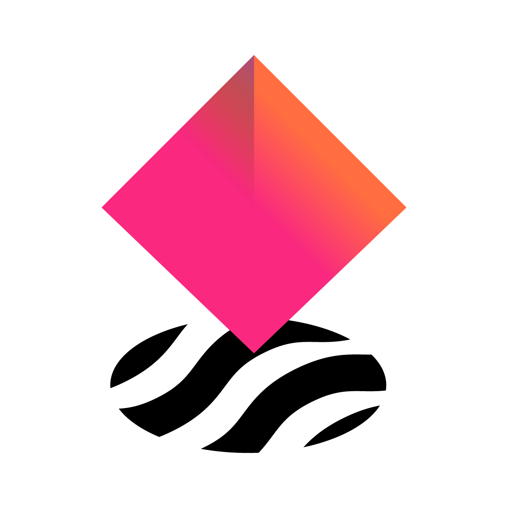
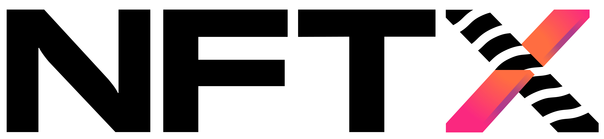
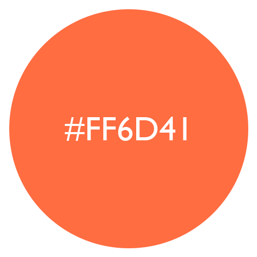
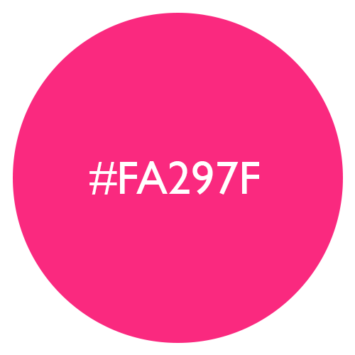

# 🎨 Brand Kit

Below you will find the main brand kit for NFTX.

## Logo

Above is the primary logomark for the NFTX DAO. Please use the correct version, based on the background it is placed on, found below.

When you have further questions on usage, contact any of the contributors on our Discord.



**.PNG format:**





**.PNG format:**





## Logo**type**

Above is the logotype for the NFTX DAO. Please use the correct version, based on the background it is placed on, found below.

When you have further questions on usage, contact any of the contributors on our Discord.



**.PNG format:**







**Download all logos at once**





## **Color Palette**

### **Primary color 1: Outrageous Orange**

**Hex: \#**FF6D41

### **Primary color 2: Rose**

**Hex: \#**FA297F

## Favicons



