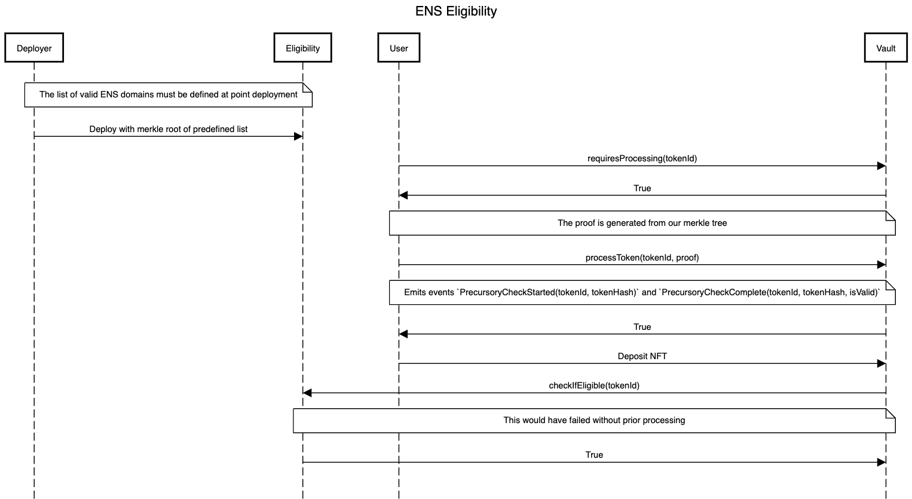

# Merkle Eligibility

The Merkle eligibility module was set up to allow a predefined array of criteria to be defined that is then validated against in a precursory check, before the token can be deemed eligible.

This module was primarily developed to allow for ENS domains to be deemed eligible, or ineligible, though there are more use-cases available. For the purpose of this document I will be applying the logic to that of the ENS flow implemented.

The reason that a merkle approach is required for ENS is that the name of the token cannot be extracted from the token itself. This would mean that for handling a collection such as the #10KClub (in which only numeric domains from 0000 to 9999 are included) we would not be able to apply a simple conditional statement to check the range. We also would not be able to simply define a list of immutable token IDs inside the vault as the deployment gas costs would be extremely high.

To combat this we instead only require the application of a merkle root (`bytes32`) onto the contract and then require a precursory check that passes a merkle proof alongside the token ID to gauge eligibility and apply it to an internally eligibility mapping.

If you'd like to read more into the application of merkle trees on the blockchain, I'd recommend reading [Using Merkle Trees for NFT Whitelists](https://medium.com/@ItsCuzzo/using-merkle-trees-for-nft-whitelists-523b58ada3f9) by @ItsCuzzo.

### Encoding ENS domains

When working with ENS domains, we need to encode and decode them in a specific way to ensure they stay the same across the frontend website and on-chain.

In my document examples you will see regular reference to a helper function called `getTokenId` that is subsequently encoded with `keccak256`. This creates two vital steps for ENS domains. The `getTokenId` returns the `tokenId` that an ENS name has. You can test this by encoding a name and checking the listing on Opensea.

```
function getTokenId(domain) {
  return ethers.BigNumber.from(ethers.utils.id(domain.toLowerCase())).toString();
}
```

_Note: This method excludes the `.eth` suffix._

When we then encode the return value with `keccak256` we get the ENS `tokenHash`. Both the `tokenId` and `tokenHash`, if calculated correctly, will correspond to the stored data on the [ENS Subgraph](https://thegraph.com/hosted-service/subgraph/ensdomains/ens).

### Generating your Merkle Tree

Generating our Merkle Tree uses 2 Node JS library:

* merkletreejs
* keccak256

The following code flow shows how to generate an ENS-compliant merkle tree, generate the root and generate a subsequent proof for later eligibility checks. Alternatively, an [online tool](https://lab.miguelmota.com/merkletreejs/example/) can be used for testing. Note, that `sortPairs` must be set to `True`.

We want to store our leaves in `bytes32` format, which is outputted from the `keccak256` encryption for consistent and gas-efficient storage.

```
  // Set up our Merkle tree leaves
  const leaves = [
    keccak256(getTokenId('a')),
    keccak256(getTokenId('b')),
    keccak256(getTokenId('c')),
  ];

  // Create a merkle tree containing the leaves defined above.
  const tree = new MerkleTree(leaves, keccak256, {sortPairs: true});
  
  // Generate our tree's merkle root
  const merkleRoot = tree.getHexRoot();
  
  // Generate a proof for b.eth
  const tokenHash = keccak256(getTokenId('b'));

  // Calculate our tree's proof from our tokenHash
  const proof = tree.getHexProof(tokenHash);
```

Once we have our proof for the `tokenHash`, we can call our precursory processing function. In most eligibility modules we can just directly call eligibility, but in order for our merkle tree approach to work, this function must be called at least once per token to ensure it's added to our `validTokenHashes` mapping.

```
/**
 * @notice This will run a precursory check by encoding the token ID, creating the
 * token hash, and then checking this against our merkle tree.
 *
 * @param tokenId The ENS token ID being validated
 * @param merkleProof Merkle proof to validate against the tokenId
 *
 * @return bool If the token is valid
 */

function processToken(uint tokenId, bytes32[] calldata merkleProof) public returns (bool) {
    // Get the hashed equivalent of our tokenId
    bytes32 tokenHash = keccak256(bytes(Strings.toString(tokenId)));

    // Determine if our domain is eligible by traversing our merkle tree
    bool isValid = MerkleProof.verify(merkleProof, merkleRoot, tokenHash);

    // Mark our hash as processed
    validTokenHashes[tokenHash] = isValid;
    _processedTokenHashes[tokenHash] = true;

    // Let our stalkers know that we are making the request
    emit PrecursoryCheckStarted(tokenId, tokenHash);
    emit PrecursoryCheckComplete(tokenId, tokenHash, isValid);

    return isValid;
}
```

Once our precursory check has been run for the token and we have deemed it valid and eligible, we are ready to mint it to the vault. Internally, the vault will just check that the encoded `tokenId` (creating the `tokenHash`) has been mapped as valid.

```
/**
 * @notice Checks if a supplied token is eligible, which is defined by our merkle
 * tree root assigned at initialisation.
 * 
 * @dev This check requires the token to have already been passed to `processToken`.
 *
 * @return bool If the tokenId is eligible
 */

function _checkIfEligible(uint tokenId) internal view override virtual returns (bool) {
    return validTokenHashes[keccak256(bytes(Strings.toString(tokenId)))];
}
```

To ensure that the `tokenId` is correctly mapped to the `tokenHash` we must convert our `tokenId` to a String and then into bytes before calling `keccak256`. Failure to do this results in an incorrect `tokenHash` being generated.

### Precursory Flow




