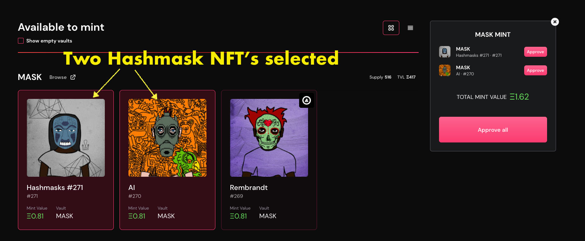
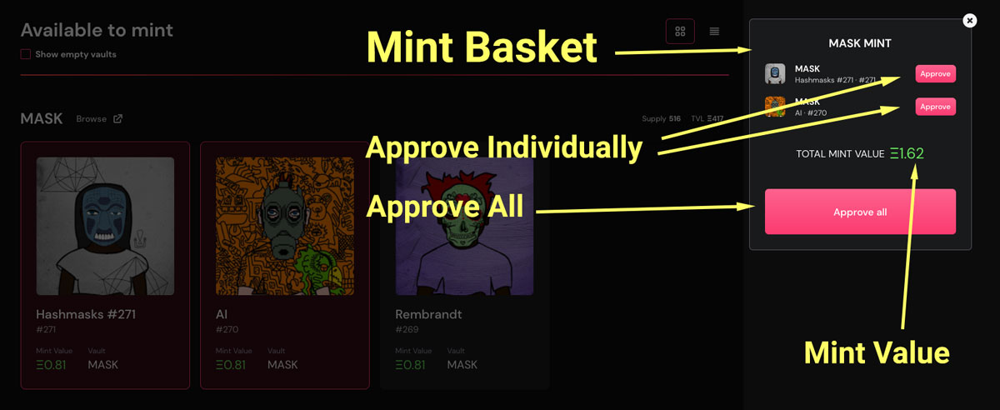
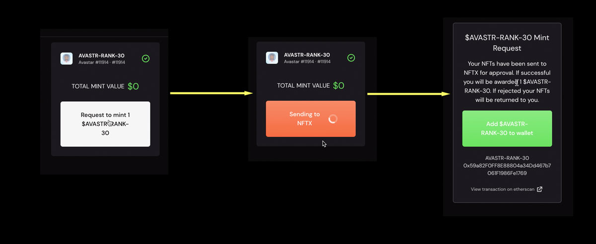

# Minting

NFTX v1.x introduces a new minting interface that allows you to easily mint a liquid ERC20 token from your NFT!

## Why mint an NFT?

By adding your NFT to an NFTX vault you mint an ERC-20 token \(xToken\) that has a 1:1 claim on a random NFT inside the vault.

Unlike a non-fungible token \(NFT\), an ERC-20 is fungible \(all tokens are the same\) and this allows it to be:

* Instantly sold at an AMM \(like Sushiswap\) 
* Pooled in an AMM to earn trading fees
* Used as collateral to borrow stablecoins

xTokens can be used to redeem a random vault NFT at any time.

## Minting Step-by-step

### Selecting NFTs

When you arrive at [app.nftx.org](https://app.nftx.org) a list of your NFTs that are available for minting will be shown. Select the NFTs you would like to mint and they will be added to your "Mint Basket".

Not seeing your NFT? [See our FAQ](https://docs.nftx.org/tutorials/get-started-v1.x/minting#faq).

### Mint Basket

The mint basket will show you the NFTs you have selected, their approval status and mint value.

#### Approval

Your NFTs will need to be approved for use by the NFTX contract before they can be minted into an ERC-20. Click the NFT line item's "Approve" button to approve each NFT individually. To approve all your NFTs in this contract \(i.e. the Wrapped Punks contract\), click "Approve all".

**Mint Value**

Mint value is taken from the mid price of the token trading on Sushiswap. The mint value does not account for slippage and liquidity. If you are looking to mint an NFT in order to sell the xToken, it is recommended that you first check the exact value you would receive from selling on Sushiswap.

If the mint value shown is $0 this means that there have been no recorded trades for the xToken on Sushiswap. This might be a good opportunity to [bootstrap liquidity](https://help.sushidocs.com/guides/how-to-add-tokens-to-sushiswap-exchange-as-an-lp) and earn liquidity provider fees!

### **Minting**

With your NFTs approved and your mint value confirmed, click the "Mint" button to generate your xTokens. Each NFT will return a single xToken.

For example, minting 3 Hashmasks to the Mask vault will return 3 MASK ERC-20 tokens.


It is important to mint your NFT to the appropriate vault. Do not mint high value NFTs \(i.e. a Punk Zombie\) to a lower value vault \(i.e. Punk-Basic\).


## Additional Info

### Eligibilities

Many vaults have an eligibility list. This ensures that the vault only accepts a certain sub-category of NFTs \(i.e. Punk-Female\).

### Mint Requests

Some vaults do not have an eligibility list as it can be cumbersome to maintain. Instead, the vault may accept "mint requests". To submit a mint request, click the "Show ineligible" checkbox next to the vault's heading. You will now be able to select your ineligible NFTs and send them to the vault owner/manager as a mint request.

When sending a mint request, your NFT will be held in escrow until the manager approves or rejects the request. If approved, your xTokens will be minted to your wallet. If rejected, your NFT will be returned.

If there is no checkbox to show ineligible NFTs, then the vault does not accept mint requests.

## FAQ

### Why aren't my NFTs showing in the minter?

If you can't see an asset it will be for one of the following reasons:

#### Your NFT is not eligible for the vault

Some vaults use eligibilities to ensure that only certain sub-categories of an NFT can be included. For these vaults, it is possible to send a [mint request](https://docs.nftx.org/tutorials/get-started-v1.x/minting#mint-requests).

#### Your NFT requires wrapping

NFTs that were developed several years ago did not follow the ERC721 or ERC1155 token standard. Token standards are used as a secure interface for other smart contracts and web3 applications. In order to mint a Cryptopunk, Mooncat or any other non-standard NFT, visit their associated wrapping website.

#### You have just received your NFT

We use the OpenSea API to detect the available NFTs that you have in your wallet. The API can sometimes take a few minutes to update before we are able to detect your NFT. Please wait 5 minutes and if it is still not showing, [reach out to us on Discord](https://discord.com/invite/fJg5burAKH).

#### Your wallet contains more than 1,000 NFTs

We currently limit the minter to scanning a wallet's first 1,000 NFTs that may be available for minting. If you have more than 1,000 NFTs in your wallet please [reach out to us on Discord](https://discord.com/invite/fJg5burAKH) for assistance.

### Can I get my NFT back once I've added it to a vault?

An xToken provides a claim on a single asset within a vault, however it does not allow the user to choose which asset. When redeeming an xToken for an NFT, the NFT received is selected at random. For this reason, depositing an NFT into a vault is not advisable for anyone with a particular attachment to that NFT.

### 

