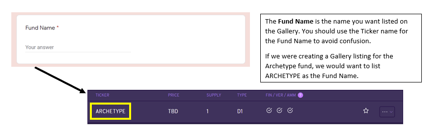
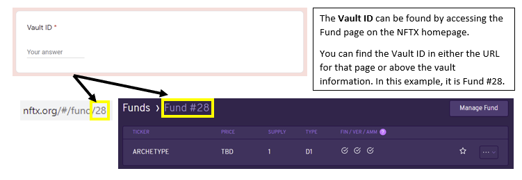
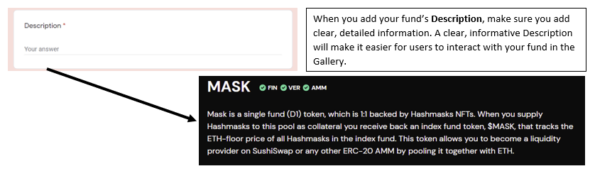
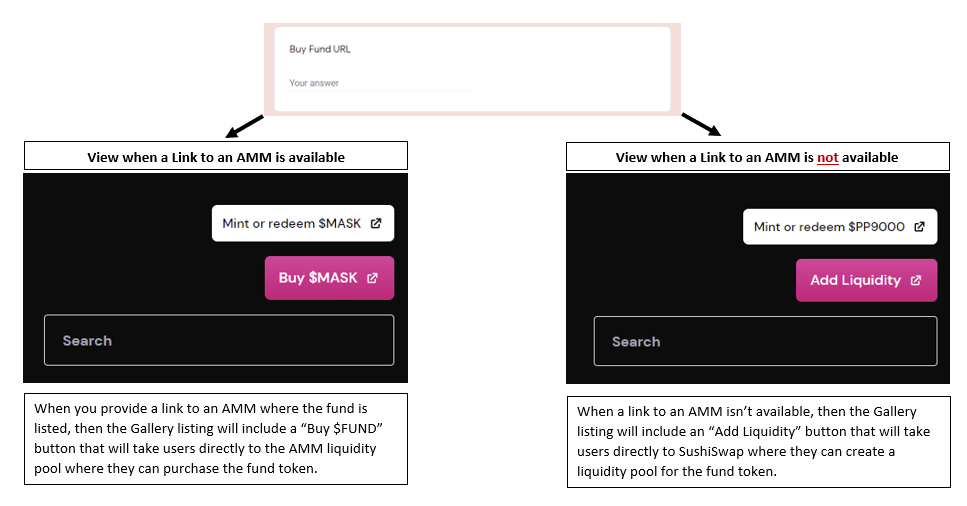

# How to get my index fund listed on the NFTX Gallery?

You've set up your NFT Index Fund and want it to be visible on the NFTX Gallery for your community? We got you.

To prevent scam funds from being promoted on the NFTX site and because there are some image/content requirements for fund displays, we've created a **listing request process** for all fund creators to follow.

Estimates of your listing request to be picked up is currently set to 24 hours, with extra time required when further due dilligence is applicable.

Below we will move past all fields you're requested to fill in. While not all fields are required, **please fill in as many as possible** to make it easier for our product team to process your request.

**Link to Listing Request:** [https://docs.google.com/forms/d/e/1FAIpQLScnaUGFuz6-iyLTCeLhcLcFfxAdpPhGzGfxDtET7qgBIJO\_xg/viewform](https://docs.google.com/forms/d/e/1FAIpQLScnaUGFuz6-iyLTCeLhcLcFfxAdpPhGzGfxDtET7qgBIJO_xg/viewform)

## Listing Details:

### **Fund Name**

This is the fully written name you'd like the fund to have when listed on the Gallery.

To be consistent between the fund as listed on the NFTX Homepage and the Gallery listing, we recommend using the same fund name that appears under the **Ticker** field on the fund page.

### **Vault ID**

Please supply the fund's VaultID number. When you're unsure what your fund's VaultID is, please follow the [How to create an NFT Index Fund tutorial. ](how-to-create-an-nft-index-fund.md)

You can also find the VaultID by checking the fund page. It is listed at the end of the **URL** and the VaultID will match the **Fund \#** on the fund's page.

### **Description**

Please describe your fund and its underlying NFT collateral. The more clear you are describing your project, the easier it will be for users to understand and interact with your fund\(s\) once listed.

### **Buy Fund URL**

If your Index Fund is also listed on an AMM \(Automated Market Maker\), often referred to as Decentralized Exchange \(DEX\), please provide a link to the pair on i.e. SushiSwap, Uniswap or Balancer.

If you fund has liquidity spread over multiple different exchanges, please supply a link an aggregator such as Matcha or 1inch instead.

If there is no listing on an AMM available for your Index Fund, we will create an **Add Liquidity** button that will direct users to SushiSwap where anyone can add liquidity to create a liquidity pool for your fund.

### **Name**

To make it easier interacting with you when the DAO has further questions, please provide your name. This is not required.

### **Discord Username**

Similar to having a name, having a Discord username is great for us to quickly reach out to you once we have additional questions.

### **Email address**

Please provide an email address so that we can reach out when your listing request requires additional information.

