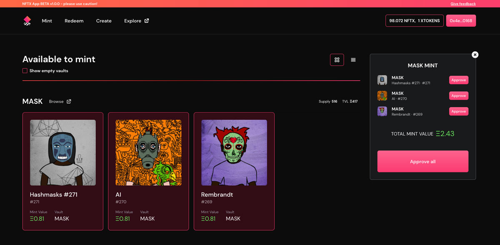
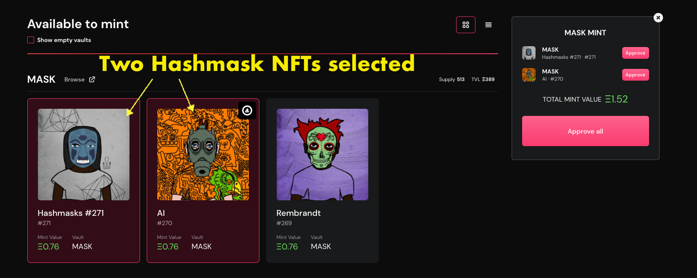
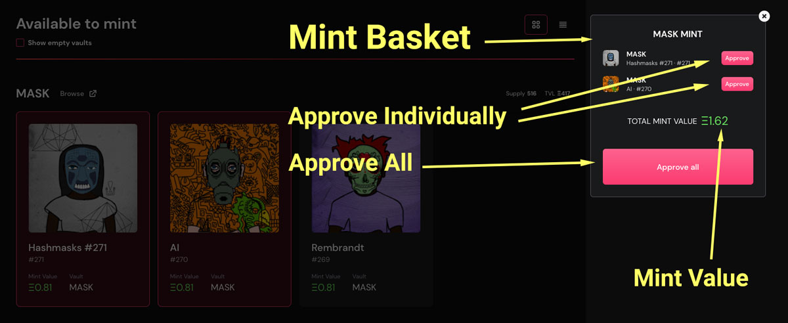

# Minting

NFTX v1.x introduces a new minting interface that allows you to easily mint a liquid ERC20 token from your NFT!

## Why mint an NFT?

By adding your NFT to an NFTX vault you mint an ERC-20 token (vToken) that has a 1:1 claim on a random NFT inside the vault.

Unlike a non-fungible token (NFT), an ERC-20 is fungible (all tokens are the same) and this allows it to be:

* Instantly sold at an AMM (like Sushiswap)&#x20;
* Pooled in an AMM to earn trading fees
* Used as collateral to borrow stablecoins

vTokens can be used to redeem a random vault NFT at any time.

## Minting Step-by-step

### Selecting NFTs

When you arrive at [app.nftx.org](https://app.nftx.org) a list of your NFTs that are available for minting will be shown. Select the NFTs you would like to mint and they will be added to your "Mint Basket".

Not seeing your NFT? [See our FAQ](https://docs.nftx.org/tutorials/get-started-v1.x/minting#faq).

### Mint Basket

The mint basket will show you the NFTs you have selected, their approval status and mint value.

#### Approval

Your NFTs will need to be approved for use by the NFTX contract before they can be minted into an ERC-20. Click the NFT line item's "Approve" button to approve each NFT individually. To approve all your NFTs in this contract (i.e. the Wrapped Punks contract), click "Approve all".

**Mint Value**

Mint value is taken from the mid price of the token trading on Sushiswap. The mint value does not account for slippage and liquidity. If you are looking to mint an NFT in order to sell the vToken, it is recommended that you first check the exact value you would receive from selling on Sushiswap.

If the mint value shown is $0 this means that there have been no recorded trades for the vToken on Sushiswap. This might be a good opportunity to [bootstrap liquidity](https://help.sushidocs.com/guides/how-to-add-tokens-to-sushiswap-exchange-as-an-lp) and earn liquidity provider fees!

### **Minting**

With your NFTs approved and your mint value confirmed, click the "Mint" button to generate your vTokens. Each NFT will return a single vToken.

For example, minting 3 Hashmasks to the Mask vault will return 3 MASK ERC-20 tokens.


It is important to mint your NFT to the appropriate vault. Do not mint high value NFTs (i.e. a Punk Zombie) to a lower value vault (i.e. Punk-Basic).


## Additional Info

### Eligibilities

Many vaults have an eligibility list. This ensures that the vault only accepts a certain sub-category of NFTs (i.e. Punk-Female).

### Mint Requests

Some vaults do not have an eligibility list as it can be cumbersome to maintain. Instead, the vault may accept "mint requests". Vaults that accept mint requests will show your ineligible NFTs and allow you to send them to the vault as a mint request.

When sending a mint request, your NFT will be held in escrow until the manager approves. If approved, your vTokens will be minted to your wallet. You can cancel your mint request at any time.

## FAQ

### Why aren't my NFTs showing in the minter?

If you can't see an asset it will be for one of the following reasons:

#### Your NFT is not eligible for the vault

Some vaults use eligibilities to ensure that only certain sub-categories of an NFT can be included. For these vaults, it may be possible to send a [mint request](https://docs.nftx.org/tutorials/get-started-v1.x/minting#mint-requests).

#### Your NFT requires wrapping

NFTs that were developed several years ago did not follow the ERC721 or ERC1155 token standard. Token standards are used as a secure interface for other smart contracts and web3 applications. In order to mint a Cryptopunk, Mooncat or any other non-standard NFT, visit their associated wrapping website.

#### You have just received your NFT

We use the OpenSea API to list the available NFTs that you may have in your wallet. The API can sometimes take a few minutes to update. Please wait 5 minutes and if it is still not showing, [reach out to us on Discord](https://discord.com/invite/fJg5burAKH).

#### Your wallet contains more than 1,000 NFTs

We currently limit the minter to scanning a wallet's first 1,000 NFTs that may be available for minting. If you have more than 1,000 NFTs in your wallet please reach out to us on Discord for assistance.

### Can I get my NFT back once I've added it to a vault?

An vToken provides a claim on a single asset within a vault, however it does not allow the user to choose which asset. When redeeming an vToken for an NFT, the NFT received is selected at random. For this reason, depositing an NFT into a vault is not advisable for anyone with a particular attachment to that NFT.

### My NFT can be deposited in multiple vaults, which one do I choose?

Some NFTs are eligible to be deposited to multiple vaults. For example, a female CryptoPunk can be deposited in either the Punk-Female or Punk-Basic vaults.

In this case, it would be essential that the female CryptoPunk is deposited in the Punk-Female vault as this vault trades at a higher value. If the female CryptoPunk was deposited in the Punk-Basic vault then it would be quickly redeemed by arbitrageurs as this asset trades higher than the PUNK-BASIC price on secondary markets like OpenSea.

Always check an NFT's available vaults before minting an vToken to ensure the most appropriate one is selected.

### I've minted my NFT but I haven't received my Token yet

There are two potential causes.

1. You need to add the vault token as a custom token to your metamask wallet (see [an example of how to add custom tokens here](https://blog.nftx.org/how-do-i-view-my-nftx-tokens-in-metamask/#how-can-you-see-your-nftx-tokens-inside-of-metamask))
2. The NFT you were minting required "Request Mint" and needs to be approved.

The second situation is the most common, so let's look at that in more detail.

The majority of the vaults on NFTX are floor vaults which will accept any NFT from the project contract. For example, it doesn't matter what type of Hashmask you own, you can always add it to the vault.

Other vaults are set up to only allow specific NFTs from the contract. These include vaults like Punk-Female which only accept Female Punks, or Punk-Zombie which only accept Zombie Punks. This eligibility is controlled through a list of permitted ID's assigned to vaults that require these limitations.

For NFT projects like CryptoKitties and Avastars it is not possible to get a full list of eligible IDs because there's either tens of thousands of ID's (Kitties) or there are still new NFTs being created (Avastars). When you mint into the following vaults and the ID hasn't already been approved it will need to be manually checked before being accepted:

* Kitty Gen 0
* Kitty Gen 0 Fast
* Avastar Rank 30
* Avastar Rank 60

The process usually takes a maximum of 24 hours, but can take longer. Here are the steps

1. You Request Mint the NFT into the vault
2. The NFTX contract holds that NFT is escrow while the check is made
3. The product team is alerted an NFT requires checking
4. The NFT is verified for the vault and a request to the dev team to approve the mint request
5. The NFT comes out of escrow and the Vault Token is sent to your wallet.

If the NFT is _not_ eligible for the vault, for example if you try to mint a generation 5 Kitty into the vault, or you try to mint a rank 20 avastar into the Rank-30 vault, then the NFT will remain in escrow until you remove it through the `revokeMintRequests` Function detailed below.


The request mint is not going to be required once the vaults move across to NFTX V2. In V2 we will be using the CryptoKitties and Avastars onchain metadata to check the validity of the NFTs and not allow the mint process if they do not below in the vault.


### How to cancel/revoke your mint requests

If you have request to mint an NFT into a vault that requires a review you can cancel that request at any time before it is accepted using the `revokeMintRequests` function.

* [ ] Visit [https://classic.nftx.org/#/backend](https://classic.nftx.org/#/backend)
* [ ] Select "Connect Accout" and connect using the wallet you used to mint the NFT

.png>)

* [ ] Choose the drop down on the right hand side of the NFTX Contract and choose `Write`

From there a side bar will open, and you can scroll down to `revokeMintRequests`

.png>)

To find the `vaultId` you can [review the list of current vaults and holdings](https://charts.mongodb.com/charts-nftx-funds-kgodb/public/dashboards/609e6965-a20a-4918-8849-9c686f6d2621). The `nftIDs` are the IDs of the NFT you would like to get back from escrow. For example:

* **VaultId** `11` (Avastar-Rank-30)
* **VauldIds** `[1234, 9786, 19111]`

