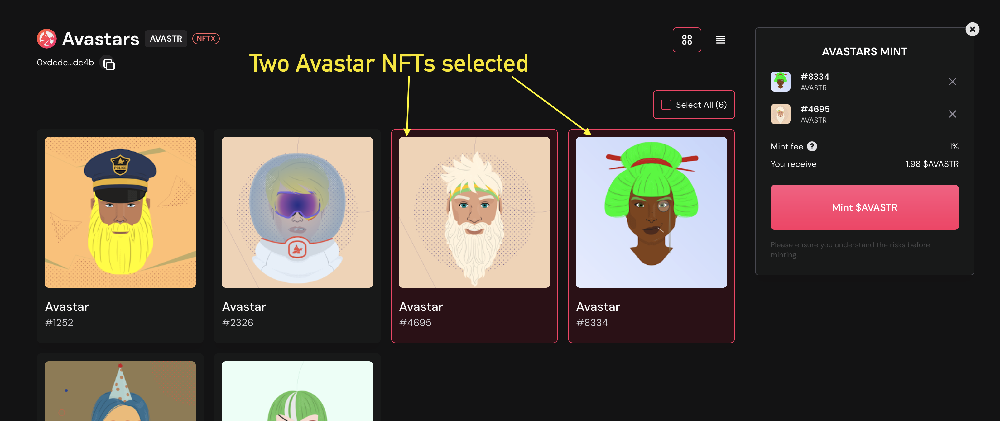

# Minting

NFTX v2 introduces a new minting interface that allows you to easily mint a liquid ERC20 token from your NFT!

 (1).png>)

## Why mint an NFT?

By adding your NFT to an NFTX vault you mint an ERC-20 token (vToken) that has a 1:1 claim on a random NFT inside the vault.

Unlike a non-fungible token (NFT), an ERC-20 is fungible (all tokens are the same) and this allows it to be:

* Instantly sold at an AMM (like Sushiswap)&#x20;
* Pooled in an AMM to earn trading fees
* Staking
* Used as collateral to borrow stablecoins

vTokens can be used to redeem a random vault NFT at any time.

## Minting Step-by-step

### Choose your vault

The initial mint view shows all the current NFTX Vaults that you are able to mint into based on the contents of your connected wallet. In this example we're going to select the [Avastr vault](https://v2.nftx.org/mint/0xdcdc1c1cc33aa817cbdbe8f5e2390bf7cc43dc4b/).

.png>)

### Selecting NFTs

Choose the NFTs from your wallet that you would like to mint to the vault. Remember, the vaults are often floor vaults and minting a higher value NFT will provide the same result as a lower value NFT from the collection.

Not seeing your NFT? [See our FAQ](https://docs.nftx.org/tutorials/get-started-v1.x/minting#faq).

### Mint Basket

The mint basket will show you the NFTs you have selected, their approval status, mint fee and the number of tokens you will recieve after minting.


Although not shown in the screenshot below, you will sometimes need to "Approve" the NFTs to be minted into the Vault. Once Approved, the "Mint AVASTR" (or relevant NFT name) will appear and you can complete the minting process.


#### Approval

Your NFTs will need to be approved for use by the NFTX contract before they can be minted into an ERC-20. To approve all your NFTs in this contract (i.e. the Wrapped Punks contract), click "Approve all".

**Mint fee & Tokens received**

The mint fee is new in v2 and will be distributed 100% to the liquidity providers.  The fee is set to a default of 5%, however during the vault creation process this can be changed to any value. Once the vault is published, only the DAO is able to update the mint fees via a governance vote.

With a 5% mint fee, each NFT minted will result in the distribution of 0.95 vTokens (in this case AVASTR tokens) with the remainder distributed to the liquidity providers.

### **Minting**

With your NFTs approved and your mint value confirmed, click the "Mint" button to generate your vTokens. Each NFT will return a single vToken, minus the mint fee.

For example, minting 2 Avastars to the Avastar vault will return 1.9 AVASTR ERC-20 tokens.


It is important to mint your NFT to the appropriate vault. Do not mint high value NFTs (i.e. a Avastar Rank 70) to a lower value vault (i.e. AVASTR).


### Bypass Mint Fee's with Zaps

To encourage more liquidity for the vaults we allow users to avoid paying the mint fee if they choose to stake liqudity for a minimum of 48 hours.

Below shows the two options

1. 5% mint fee and get back 0.95 vTokens
2. 0% mint fee and get back 1 vToken

Choosing the Mint & Stake option requires an additional confirmation step, also shown below. This provides an overview of the number of tokens you are pairing, and the amount of ETH you need to pair for the pool.

* **Pool share** — the share of the fee's earned on this vault that you will get each block. In this case, it is 50% of the fee distribution.
* **Mint fee** — you are being waived the mint fee for staking your liquidity for 48 hours.
* **Lock time** — the length of time your position will be locked. After 48 hours you can unstake and withdraw your liquidity.


Remember that if you already have a position on the vault your entire position will be locked for the 48 hours, not just the amount you are zapping on this process. This does not affect any other positions you might have in other vaults on NFTX.


Once you have confirmed the Mint & Stake you can view the Staking page to see your positions, and the time left on your locked positions.

### Mint Requests

In v2 there are no longer any mint requests.

## FAQ

### Why aren't my NFTs showing in the minter?

If you can't see an asset it will be for one of the following reasons:

#### Your NFT is not eligible for the vault

Some vaults use eligibilities to ensure that only certain sub-categories of an NFT can be included. For these vaults, it may be possible to send a [mint request](https://docs.nftx.org/tutorials/get-started-v1.x/minting#mint-requests).

#### Your NFT requires wrapping

NFTs that were developed several years ago did not follow the ERC721 or ERC1155 token standard. Unlike in V1, the V2 vaults now support unwrapped Mooncats and CryptoPunks.

#### You have just received your NFT

We use the OpenSea API to list the available NFTs that you may have in your wallet. The API can sometimes take a few minutes to update. Please wait 5 minutes and if it is still not showing, reach out to us on Discord.

#### Your wallet contains more than 1,000 NFTs

We currently limit the minter to scanning a wallet's first 1,000 NFTs that may be available for minting. If you have more than 1,000 NFTs in your wallet please reach out to us on Discord for assistance.

### Can I get my NFT back once I've added it to a vault?

A vToken provides a claim on a single asset within a vault. In v2 we have introduced targeted redeems which allows you to choose any NFT from the vault for a 5% premium (this is the default settings, vault owners can change this value during the vault creation process).

You can buy additional vTokens from SushiSwap, and we will soon allow you to make up the additional costs with ETH directly from the App.

### My NFT can be deposited in multiple vaults, which one do I choose?

Some NFTs are eligible to be deposited to multiple vaults. While this is still possible in v2, the initial vaults created have moved away from multiple vaults for the same NFT and towards floor vaults.

Always check an NFT's available vaults before minting an vToken to ensure the most appropriate one is selected.

### I've minted my NFT but I haven't received my Token yet

You need to add the vault token as a custom token to your metamask wallet (see [an example of how to add custom tokens here](https://blog.nftx.org/how-do-i-view-my-nftx-tokens-in-metamask/#how-can-you-see-your-nftx-tokens-inside-of-metamask))

