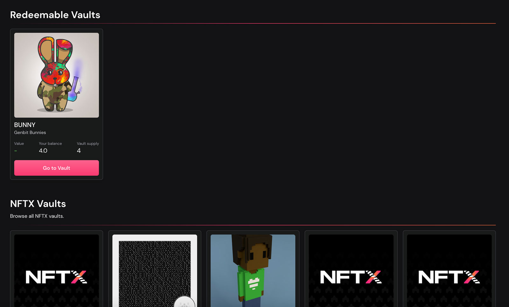

# Redeeming


The documentation on this page is still in progress.


NFTX v2 allows you to easily redeem your [minted](minting.md) ERC20 Vault Tokens \(vTokens\) for either a random or targeted NFT within the vault.

## Why redeem an NFT?

Redemptions allow users to take ownership of an underlying NFT from within a vault. This means that a user can go to an AMM like Sushiswap, purchase a single vToken like PUNK-BASIC and use that token to claim a random CryptoPunk from the [Punk-Basic vault](https://gallery.nftx.org/funds/punk-basic/).

For an additional fee, usually 5%, users are able to select a specific NFT from the vault.

## Redeeming Step-by-Step

### vToken Balance

When you visit [https://v2.nftx.org/redeem](https://v2.nftx.org/redeem) and connect your wallet, your vToken and NFTX balances will be displayed on the right hand side. Each vToken represents a claim on a random NFT from within its vault.

You can also target redeem specific NFTs from the vault by paying the Targeted Redeem fee — often 5% or 1.05 vTokens.


Don't have any vTokens? [Visit our Explore section](https://v2.nftx.org/explore/) to browse the available vaults and exchange trading pairs.


### Redeeming — Random

To redeem an NFT you must enter the quantity you would like to redeem \(in whole numbers\) next to the "Random" section in the redemption baskset and approve the NFTX contract. Once the approval transaction has been confirmed, you will then be able to redeem the desired number of NFTs from the vault.

### Redeeming — Targeted

New in V2 is the option to choose the NFT you wish to redeem from the vault.

Select the NFT you wish to redeem from the vault and they will be added to the redeem basket. Note that each targeted redeem will require 1 vToken plus the fee set for targetted redeems on the vault. This fee defaults to 5% on vault creation, but can be changed by the vault creator prior to finalising the vault. Once finalised, the fee's can only be updated by the DAO via a governance vote.

If the vault is left at the default settings, each targeted redeem will cost 1.05 vTokens.

## FAQ

### Can I redeem from a vault without a vToken?

Users must have a vToken in their wallet balance to redeem from a vault. To browse the available vaults and vault NFTs, please visit the [Explore section of the App](https://v2.nftx.org/explore/).

