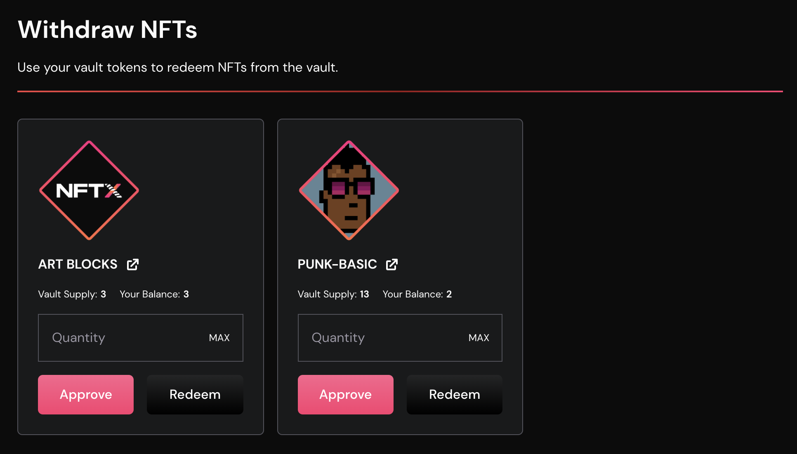
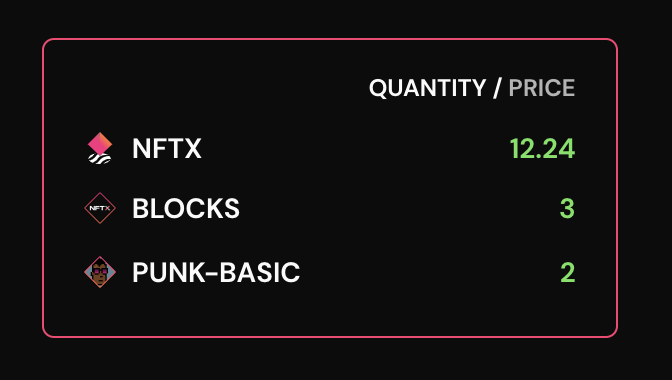

# Redeeming

NFTX v1.x allows you to easily redeem your [minted](minting.md) ERC20 Vault Tokens \(vTokens\) for a random NFT within the vault.

## Why redeem an NFT?

Redemptions allow users to take ownership of an underlying NFT from within a vault. This means that a user can go to an AMM like Sushiswap, purchase a vToken like PUNK-BASIC and use that token to claim a random CryptoPunk from the [Punk-Basic vault](https://gallery.nftx.org/funds/punk-basic/).

## Redeeming Step-by-Step

### vToken Balance

When you visit [https://app.nftx.org/redeem](https://app.nftx.org/redeem) and connect your wallet, your vToken and NFTX balances will be displayed on the right hand side. Each vToken represents a claim on a random NFT from within its vault.


Don't have any vTokens? [Visit our Gallery](https://gallery.nftx.org) to browse the available vaults and exchange trading pairs.


### Redeeming

To redeem an NFT you must enter the quantity you would like to redeem \(in whole numbers\) and approve the NFTX contract. Once the approval transaction has been confirmed, you will then be able to redeem the desired number of tokens.

Once the redeem transaction is confirmed, a receipt will be shown that includes an Etherscan link for viewing NFT ID that was redeemed.

## FAQ

### Can I choose what NFTs I redeem?

The current version of the NFTX protocol does not allow for specific redemptions. This is a feature that will be made available in V2.

### Can I redeem from a vault without a vToken?

Users must have a vToken in their wallet balance to redeem from a vault. To browse the available vaults and vault NFTs, please visit the [NFTX Gallery](https://gallery.nftx.org).

