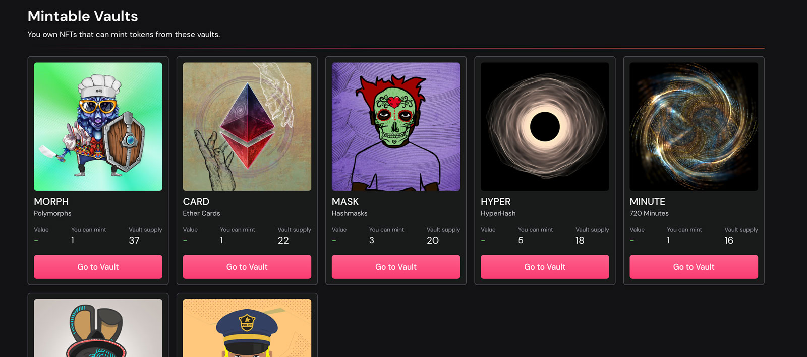
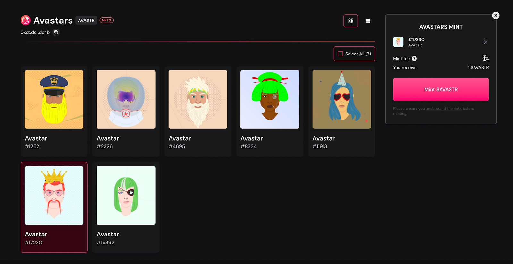
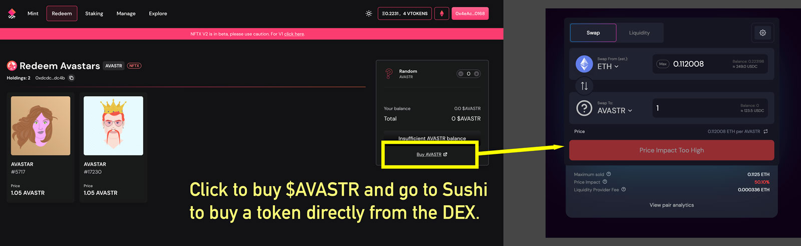

# Staking

## Why stake on NFTX?

Earn fees from the vault, currently 100% of protocol fees are paid out to those that stake. Stakers also receive an ERC20 “xToken” like xPUNK that is a claim on the underlying staked SLP. We expect other projects to build use cases for these xTokens.

## How to stake on NFTX?

To stake on NFTX you first need to get a token for one of the NFTX vaults. In this example we're going to look at the $AVASTR vault.

### Get a vToken

There are two ways that you can get a vToken \(vault Token\) from NFTX. Head to [https://v2.nftx.org](https://v2.nftx.org) and you will see a list of the current vaults you can mint into based on the NFTs in your wallet

In this example I'm going to mint one of my Avastars into the $AVASTR vault. I choose the Avastar that I would like to mint and select "Mint $AVASTR". This provides me a single $AVASTR token back.

Alternatively, you can go to the Redeem section of the app and look to redeem an Avastar from the vault. From here you will have a link to buy an $AVASTR token directly from Sushi.

With a vToken, in this case an $AVASTR token, you can head over to the [Staking](https://v2.nftx.org/staking/) page.

### Add Liquidity

From the Staking page you can find the pair that you want to provide liquidity for, in this case it is the AVASTR-ETH SLP, and we want to Add Liquidity to that pool

From this page you can add the amount of AVASTR you want to add to the pool, and the relevant amount of ETH will be calculated below. If you are the first liquidity provider then you will need to set the initial price, which should be the floor price of the NFTs for the vault. One way to calculate this is to search for your NFT contract on OpenSea with the filter Buy Now and order from Lowest to Highest sale price.

Once you have confirmed adding liquidity you will be issued with pool tokens.

### Stake your LP

With your pool tokens you can return to the Staking screen, Approve the use of the SLP \(this will be where the "Deposit SLP" button can be seen\), and then "Deposit SLP".

Once completed, any pools that you are currently staking will be shown at the top of the staking page with details on your APY, Staked amount, Earnings, and Claimable AVASTAR tokens.


Staking rewards are not yet active while the passive vault migration is happening. We recommend setting up your position in the pools you are interested so that when they are turned on you can start earning yield immediately.


## Removing Liquidity from V1 Vaults 

### Overview

With the release of NFTX Version 2 there is more benefit from moving your position from the old vaults on V1 to the new vaults on V2.

For an overview on the release of NFTX V2 you can read the blog, however in this tutorial we’re going to focus on how you can remove your liquidity from existing vaults on V1.

### Steps to remove your liquidity

Head over to the pool which you are providing liquidating. An easy way to do this is to find the Vault on the [gallery](https://gallery.nftx.org) and select the “Swap on Sushi” button.

Choose the “Liquidity” tab from that pool and then select “Remove” from the options. In this case we’re going to remove all of our liquidity from the pool and we will get back 0.0811434 ETH and 2.09975 TWERKY tokens.

You will first need to “Approve” the transaction and then “Confirm Withdrawl”.


Note: there is no rush for you to remove your liquidity from the pool, especially while GAS prices are high.


Once the transaction has been processed you will receive a confirmation along with details about the final Tokens and ETH returned.

You will now be able to view your tokens in Metamask, and if you go to the NFTX App you can see your tokens in the header and sidebar.  

With you tokens you can now Redeem your NFTs from the Vault which will then allow you to 

### FAQs

#### Do I have to remove my Liquidity?

No. You can keep your liquidity on the current vaults in V1 for as long as you would like and continue to earn fees on the trades on SushiSwap.

You will not be able to stake your liquidity and earn any of the 1% minting and 5% targeted fees on the new vaults unless you become a liquidity provider on V2.

#### I still have fractions of a token left after withdrawing my liquidity, what can I do?

These fractions of tokens are often referred to as dust. You have three options.

1. Sell the fractions of the token you have on a DEX like SushiSwap.  For low value NFTs there is a good chance that the GAS cost of this transaction will exceed the value of the dust.
2. Buy more of the token to take you up to one full token and use it to redeem an NFT from the pool.
3. Hold onto the dust until NFTX move towards a buyout. We expect there will be one NFT stuck in each of the vaults due to the dust and reduction of the liquidity. There are two options for resolving this which the DAO will vote on in the next few months
   1. The DAO will sell the final NFT and provide the fractionalised value of the sale to the dust holders.
   2. The DAO will propose to buy back the dust to retrieve the final NFT and keep it in the treasury

#### When will the NFTX DAO remove their liquidity from the V1 Vaults?

The DAO will remove their Liquidity in thirds across three weeks starting from the public release of V2. This is to ensure that holders of the NFT Tokens have time to sell their position without any major slippage/price impact. 


Lower liquidity does not impact the redeeming of NFTs from the V1 Vaults.  1 Token is always worth 1 NFT from the corresponding vault.


