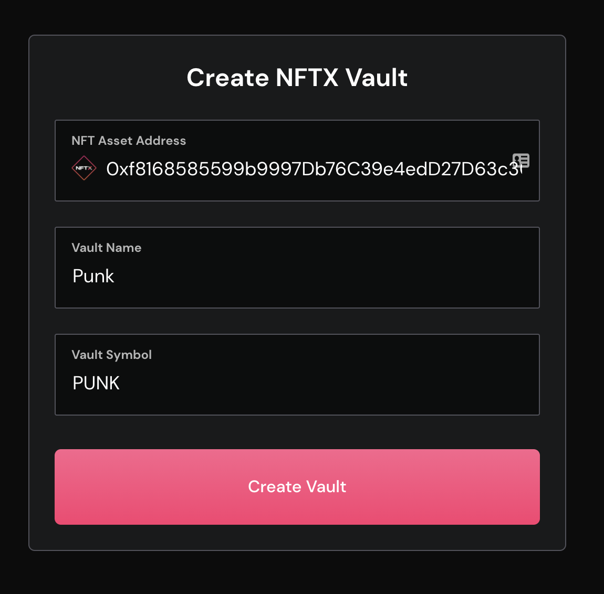
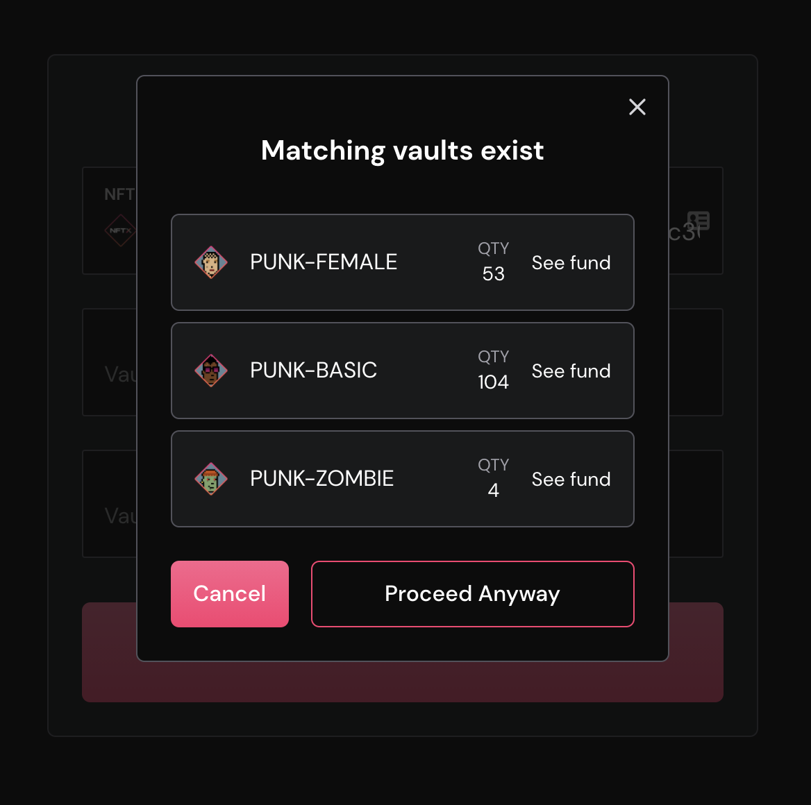
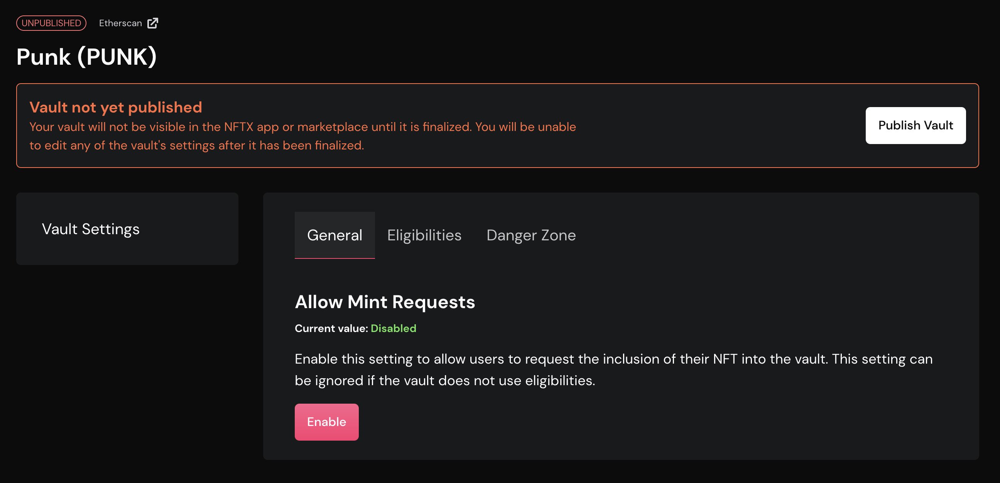
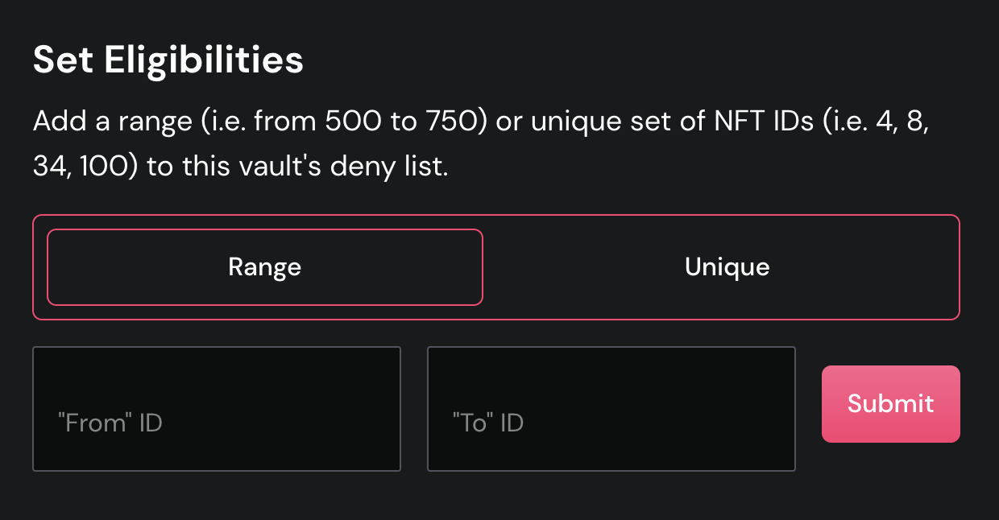
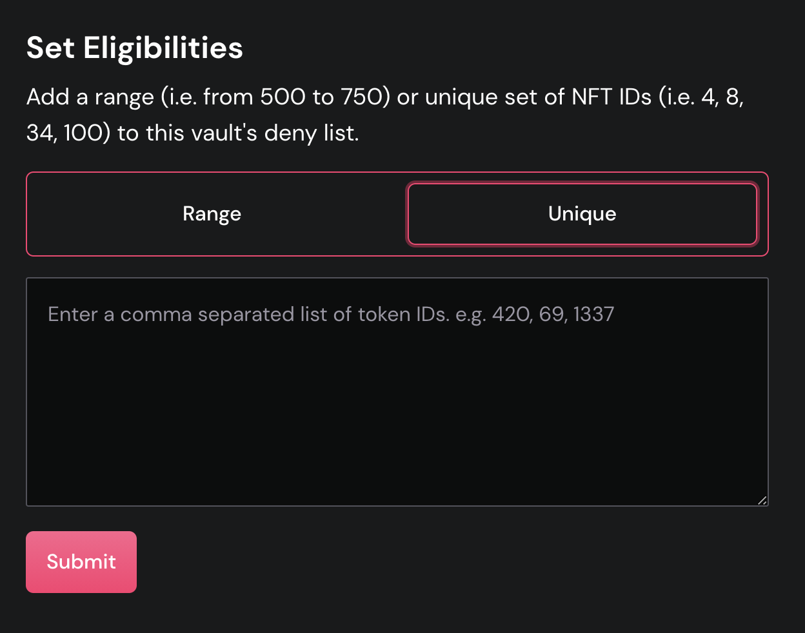

# Vault Creation

NFTX v1.x introduces a new vault creation interface that allows you to easily create a public vault for any NFT or a specific subset of IDs for an NFT.

## Why create a vault?

Vault creation is at the heart of the NFTX protocol and allows users and content creators to begin [minting](minting.md) fungible ERC20 tokens for any NFT.

By creating NFT-backed ERC20 tokens, users can create liquid markets for otherwise illiquid NFTs whilst also earning fees and rewards from liquidity provision.

Protocol fees will also be introduced in V2 of the NFTX.

## Vault Creation Step-by-Step

### Create NFTX Vault

Three fields are required to create an NFTX vault as shown below.

**NFT Asset Address**

The NFT asset address is immutable and points to the contract from which this vault will accept mints. By default, all NFT IDs from this contract will be eligible for minting in the vault.


Eligibility lists can be added once the vault has been created. This will allow you to target specific properties like "Female Punks" from within an asset.


Some assets are already used in other vaults. For example, Wrapped CryptoPunks are used in multiple vaults and separated using eligibility lists. To avoid adding a duplicate vault and splitting liquidity, review the matching vaults list before proceeding.

**Vault Name**

This will be the _name_ of the ERC20 token that is minted from this vault.

**Vault Symbol**

This will be the _symbol_ of the ERC20 token that is minted from this vault.

Both the Vault Name and Vault symbol will appear anywhere that this token appears, from CoinGecko and Etherscan through to Sushi and Uniswap.


A strong name and symbol play a critical part in a vault's long-term success. Please review our recommended naming conventions to help maximize your vault's exposure.


### Vault Created

Once your create vault transaction has been confirmed onchain you will be notified and asked to proceed to managing your vault.

Your vault will not be visible in the NFTX app until it has been minted to and published. Click "Manage Vault" to complete the process.


The NFTX subgraph is currently under development. As a result, newly created vaults take up to 5 minutes to be visible on the front end.


### Manage Vault

Vault management allows vault creators to modify a number of important settings as well as publishing the vault so that it becomes visible on the NFTX app.


Published vaults cannot be edited by the creator. Carefully review the vault's settings before publishing.


**Allow Mint Requests**

By enabling this setting, users will have to make a request to mint their NFT to this vault. Once a vault is published, mint requests will be reviewed and approved by the DAO.

**Eligibilities**

A vault's eligibility list is an allow list of NFT IDs that can be minted to this vault. This can be flipped into a deny list by enabling the "Negate Eligibilities" setting \(see "Negate Eligibility" below\).

**Eligibility Range**

For blocks of eligible IDs, use this setting to specify the "from" and "to" \(inclusive\) IDs that will be added to the eligibility list.

**Unique Eligibilities**

Use this setting to specific individual IDs to add to the eligibility list.

**Negate Eligibility**

The negate eligibility setting flips the eligibility list into an allow \(negate eligibility disabled\) or deny list \(negate eligibility enabled\). For clarity, see the following examples.

| Setting | Eligibilities | Example Allowed | Example Denied |
| :--- | :--- | :--- | :--- |
| Negate Eligibility Enabled | 1, 2, 3, 4, 5 | 2, 3, 5 | 2, 3, 5 |
| Negate Eligibility Disabled | 1, 2, 3, 4, 5 | 6, 8, 10 | 6, 8, 10 |

### Vaults Overview

To view your vaults at any time click the "Manage" link in the navigation. This link is only visible to connected wallets that are a manager of at least 1 vault.

## FAQ

### I am being warned about the vault name or symbol, what does this mean?

Naming conventions provide structure for NFTX vaults that makes them instantly recognisable across platforms and help improve the network effects for all participants in the NFTX ecosystem.

**Naming conventions**

| Vault Name | Vault Symbol |
| :--- | :--- |
| Alphanumeric only | Less than 6 characters |
| Capitalized \(i.e. Punk Attribute 4\) | Singular \(i.e. PUNK for CryptoPunks floor vault\) |

The tight recommendations on Vault Symbol are in place to conform to Twitter's cashtag standard.

### My vault isn't showing in the NFTX app

The most common reason for this is that your vault does not yet have holdings or has not been published. To add holdings, visit the vault management page and click "Add Holdings".

If the vault is still not appearing, you may need to wait for a maximum of 5 minutes while the vault is indexed. This delay will become immediate once the NFTX subgraph is deployed in V2 of the protocol.

