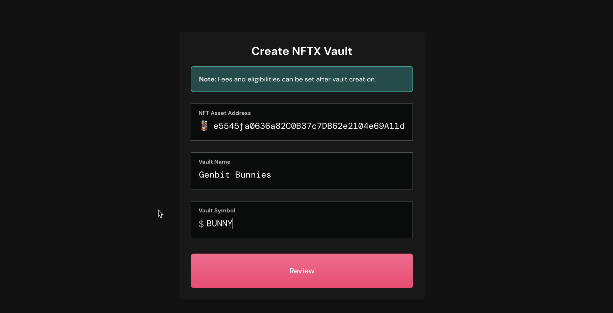
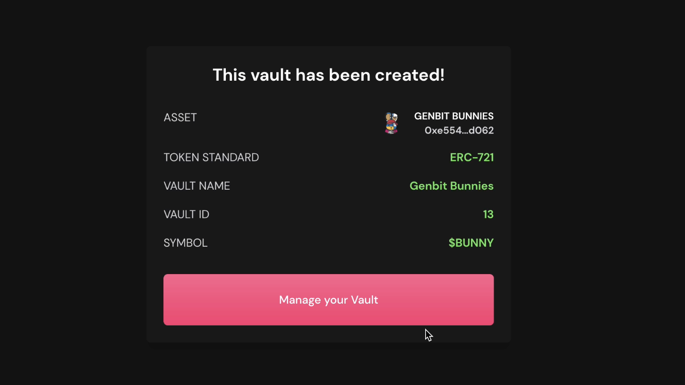
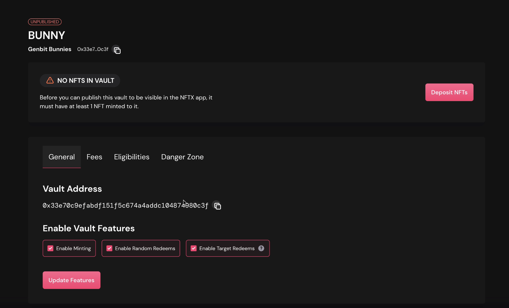
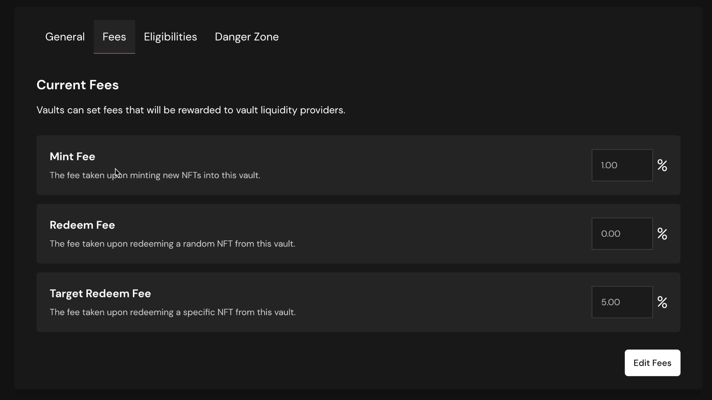
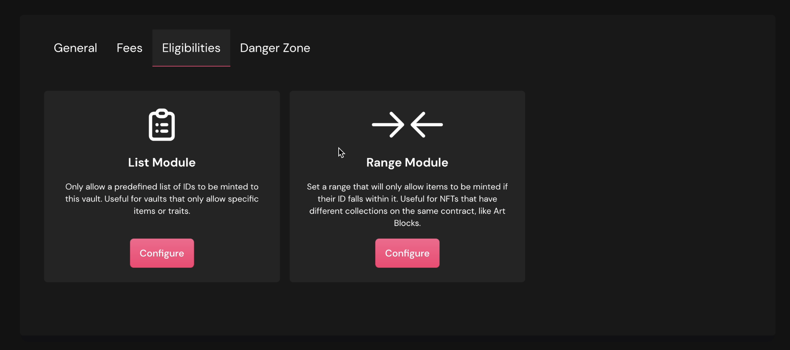
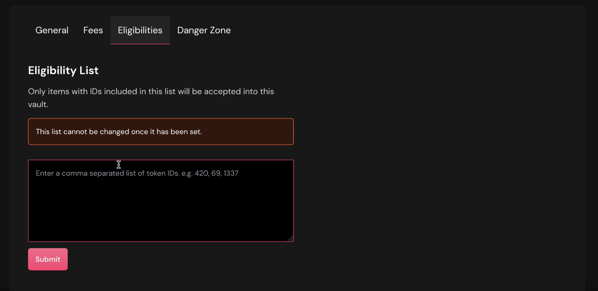
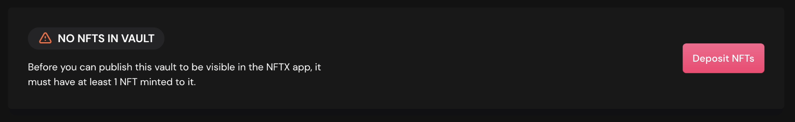
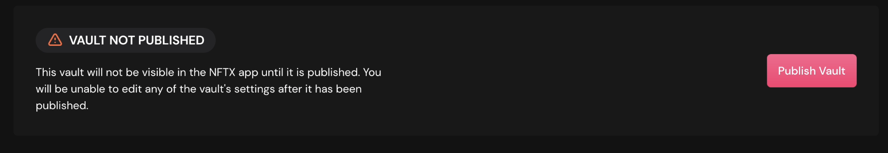
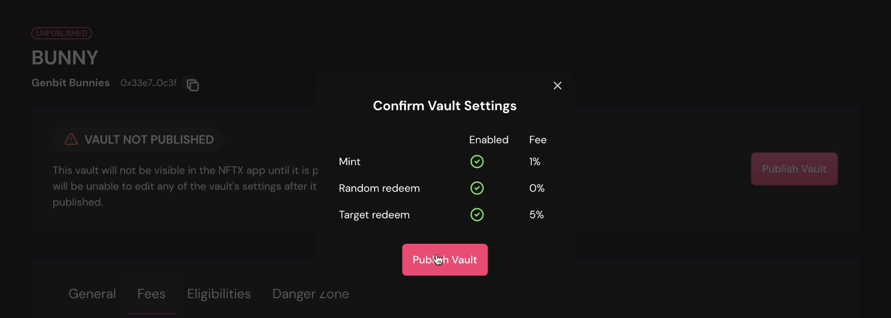
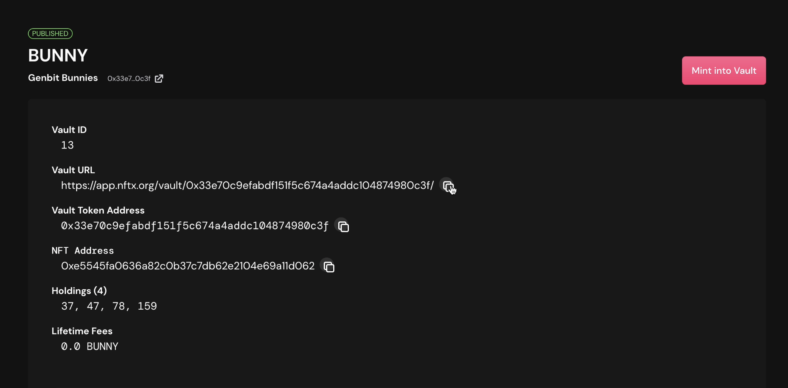

# Vault Creation

NFTX v2 introduces a new vault creation interface that allows you to easily create a public vault for any NFT or a specific subset of IDs for an NFT.

[Watch the video tutorial for creating vaults on NFTX V2](https://www.youtube.com/watch?v=Yt2aU7hxMmc)

## Why create a vault?

Vault creation is at the heart of the NFTX protocol and allows users and content creators to begin [minting](minting.md) fungible ERC20 tokens for any NFT.

By creating NFT-backed ERC20 tokens, users can create liquid markets for otherwise illiquid NFTs whilst also earning fees and rewards from liquidity provision.

Protocol fees are also introduced in V2 of the NFTX.

## Vault Creation Step-by-Step

### Create NFTX Vault

Three fields are required to create an NFTX vault as shown below.

**NFT Asset Address**

The NFT asset address is immutable and points to the contract from which this vault will accept mints. By default, all NFT IDs from this contract will be eligible for minting in the vault.


Eligibility lists or ranges can be added once the vault has been created. This will allow you to target specific NFT IDs for groups of NFTs like "Female Punks", or create NFT ID ranges for specific projects like "720 Minutes" from Art Blocks, from within a single NFT contract address.


Some assets are already used in other vaults. For example, Art Blocks are used in multiple vaults and separated using eligibility ranges. To avoid adding a duplicate vault and splitting liquidity, review the matching vaults list before proceeding.

**Vault Name**

This will be the _name_ of the ERC20 token that is minted from this vault.

**Vault Symbol**

This will be the _symbol_ of the ERC20 token that is minted from this vault.

Both the Vault Name and Vault symbol will appear anywhere that this token appears, from CoinGecko and Etherscan through to Sushi and Uniswap.


A strong name and symbol play a critical part in a vault's long-term success. Try to keep the name singular \(PUNK, not PUNKS\), six characters or less \(to enable ticker links in Twitter\), and use a real word where possible \(BUNNY, not GENBIT\).


### Vault Created

Once your create vault transaction has been confirmed onchain you will be notified and asked to proceed to managing your vault.

Your vault will not be visible in the NFTX app until it has been minted to and published. Click "Manage Vault" to complete the process.

### Manage Vault

Vault management allows vault creators to modify a number of important settings as well as publishing the vault so that it becomes visible on the NFTX app.


Published vaults cannot be edited by the creator. Carefully review the vault's settings before publishing, including setting the Fees and Eligibility screens.


#### **Enable Vault Features**

**Enable Minting —** The most important part of creating a vault is allowing users to mint their NFTs in. If you wanted to use the vault as a way to airdrop tokens for users to redeem NFTs from the vault you might disable the mint feature.

**Enable Random Redeems —** Allow users to randomly retrieve an NFT from your vault.

**Enable Target Redeems** — Users will be able to choose the NFTs they are redeem from the vault for an additional fee which you can set within the Fees section.

#### Fees

Fees can now be set on the individual vaults which will then be distributed to the liqudity providers staking their LP. By default all new vaults are set with 1% Mint Fee \(meaning you receive 0.99 tokens for each NFT minted\), 0% Redeem Fee \(so 1 token always can redeem 1 random NFT from the vault\), and a 5% Targeted Redeem Fee \(1.05 tokens are needed to choose the NFT you want from the vault\).

When you first create the vault, and _**before**_ you finalise the vault, you can set the mint fees to 0% to encourage the initial seeding of the vault. Once seeded, ensure that you change the fee back to 1% before finanlising the vault or no fees will be generated on minting NFTs.


In a future release, Zaps will allow users who also provide ETH liquidity for the vault to bypass the 1% mint fee set.


#### **Eligibilities**

A vault's eligibility list is an allow list or range of NFT IDs that can be minted to this vault.

**List Module**

Use this setting to specific individual IDs to add to the eligibility list.

**Eligibility Range**

For blocks of eligible IDs, use this setting to specify the "from" and "to" \(inclusive\) IDs that will be added to the eligibility list. _\*\*_These work well for projects like Art Blocks Curtated which are all minted from the same contract but have distinct ranges for each project.

### Publishing your Vault

Before your vault will be visible on the app you will need to mint at least one eligible NFT.

Once you've added one or more NFTs to your new vault you will have the option to publish your vault. Remember, once the vault has been published the ownership is passed to the DAO and you will no longer be able to update the Fees or Eligibilities.

Once confirmed you will be redirected to the vault detail page. On this page it will provide you with an overview of the vault details, including Vault ID, URL, Token Address, current Holdings, and Lifetime Fees.

## FAQ

### I am being warned about the vault name or symbol, what does this mean?

Naming conventions provide structure for NFTX vaults that makes them instantly recognisable across platforms and help improve the network effects for all participants in the NFTX ecosystem.

**Naming conventions**

| Vault Name | Vault Symbol |
| :--- | :--- |
| Alphanumeric only | Less than 7 characters |
| Capitalized \(i.e. Meebits\) | Singular \(i.e. PUNK for CryptoPunks floor vault\) |
|  | Uppercase |
|  | Real words where possible |

The tight recommendations on Vault Symbol are in place to conform to Twitter's cashtag standard.

### Why isn't my vault isn't showing in the NFTX app?

The most common reason for this is that your vault does not yet have holdings or has not been published. To add holdings, visit the vault management page and click "Add Holdings".

